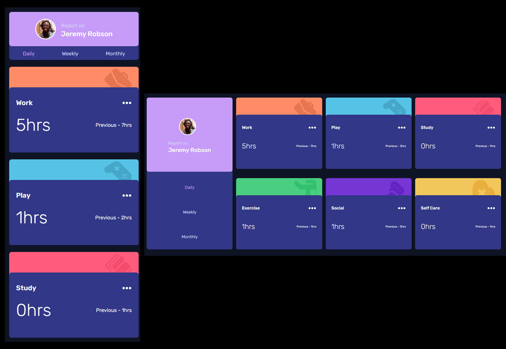

# Frontend Mentor - Newsletter sign-up form with success message solution

This is a solution to the [Newsletter sign-up form with success message challenge on Frontend Mentor](https://www.frontendmentor.io/challenges/newsletter-signup-form-with-success-message-3FC1AZbNrv). Frontend Mentor challenges help you improve your coding skills by building realistic projects. 


## Table of contents

- [Overview](#overview)
  - [Screenshot](#screenshot)
  - [Links](#links)
- [My process](#my-process)
  - [Built with](#built-with)
  - [What I learned](#what-i-learned)
  - [Continued development](#continued-development)
  - [Useful resources](#useful-resources)
- [Author](#author)
- [Acknowledgments](#acknowledgments)

**Note: Delete this note and update the table of contents based on what sections you keep.**

## Overview

### Screenshot



### Links

- Solution URL: (https://github.com/Junbol-Frontend-Mentor/newsletter-sign-up-with-success-message)
- Live Site URL: (https://junbol-frontend-mentor.github.io/newsletter-sign-up-with-success-message/)

## My process

### Built with

- Semantic HTML5 markup
- CSS custom properties
- Sass(SCSS)
- BEM (Block.Element.Modifier)
- Flexbox
- Mobile-first workflow
- GIT/GitHub
- PowerShell (CLI)

### What I learned

Working with SCSS animations, BEM & MediaQueries

```

  .wrapperLogo {
    position: relative;

    &:hover {
      .wrapperLogo__img {
        //🚩 you cannot use & becasue its parent will be hover
        opacity: 0; /* Fade out the logo */
        transform: translateY(-20px); /* Move the logo up */
      }

      .wrapperLogo__text {
        opacity: 1; /* Fade in the text */
      }
    }

    &__img {
      width: 100%; /* Adjusted size */
      transition: transform 0.5s ease-in-out, opacity 0.5s ease-in-out;
    }

    &__text {
      @include typography('Poppins', 700, 3rem, 1.2, color('white'));
      position: absolute;
      top: 50%;
      left: 50%;
      transform: translate(-50%, -50%);
      opacity: 0; /* Initially hidden */
      font-weight: 800;
      transition: opacity 2s ease-in-out; /* Only opacity transition */
    }
  }

And if you want to see the animation go and take a look at it, use it if you want. I just liked what Josh in https://www.joshwcomeau.com/ did probably in React study the code and try to replicate it.
```

### Continued development

I would like to continue studying responsive SCSS specially with Grid + Flexbox and CSS animation, transitions and FX like parallax.

### Useful resources

- [web.dev](https://web.dev/learn/css) - This helped me for get back on track with CSS.
- [w3schools](https://www.w3schools.com/css/default.asp) - The one place to refresh stuff in practical way.

## Author

- Website - [Junier Bolivar](https://www.bolivarcreativedesign.com)
- Frontend Mentor - [Junbol](https://www.frontendmentor.io/profile/Junbol)
- Twitter - [@JunierBolivar](https://www.twitter.com/@JunierBolivar)

## Acknowledgments
